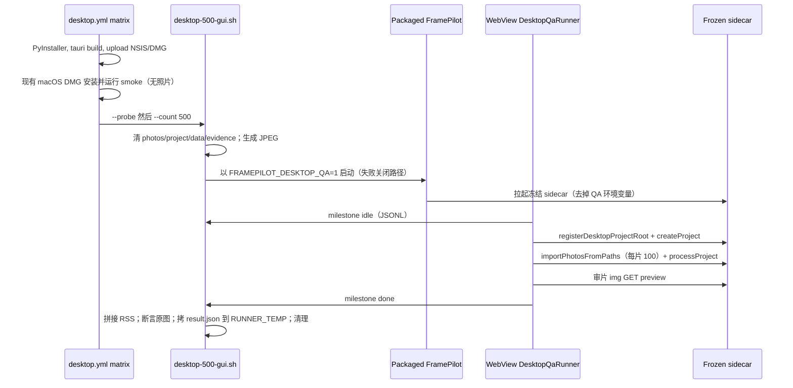

# 残留：无人值守包装桌面 ≥500 GUI

> 语言：**中文** | [English](2026-09-07-desktop-500-gui.md)

**GitHub：** [joe-cheung-cae/frame-pilot#179](https://github.com/joe-cheung-cae/frame-pilot/issues/179)。2026-09-07 查询开放 issue 为空（最近残留 [#177](https://github.com/joe-cheung-cae/frame-pilot/issues/177) 已由 [#178](https://github.com/joe-cheung-cae/frame-pilot/pull/178) 关闭）后创建。不要重开 [#144](https://github.com/joe-cheung-cae/frame-pilot/issues/144) 或 [#172](https://github.com/joe-cheung-cae/frame-pilot/issues/172)。不要把本工作折进 #177。

**分支：** `feature/desktop-500-gui`，从 `origin/main` @ `a945c3160631747e10bc53d5576da789700799b5`（`ci: macOS DMG installer GUI smoke (leftover DoD) (#178)`）。命名 worktree：`/home/joe/repo/frame-pilot-desktop-500-gui`（与 `/home/joe/repo/frame-pilot` 上的 `feature/macos-gui-dod` 分开）。后续阶段：**isolation_worktree 为 false** — 编辑本 worktree，不要再新建。不要把本残留提交到 `feature/macos-gui-dod`。不要为提交 checkout `main`。不要合入 `main`。不要 squash。不要 force-push。

**相关：** `develop_plan.md` §1.1；`docs/desktop_development_plan.md` §2.2 与 §5.6；`docs/desktop_testing.md`；`docs/v2_performance_baseline.md`；`.github/workflows/desktop.yml`；`packaging/scripts/macos-dmg-gui-smoke.sh`；`scripts/test-release-checks.sh`；工作流 `.grok/workflows/desktop-500-gui.rhai`。草稿 PR [#180](https://github.com/joe-cheung-cae/frame-pilot/pull/180)。

需求拆解（Slice 0）是文档合同。Slice 1 Linux skip-not-pass 已在树里。评审 已按活树修正规格漏洞。本次 归档 提交只记录 开发 交接。**不要**扩展 harness，也不要加 `desktop.yml` 的 probe/500 步骤。**不要**勾 开发、DoD-ticked 或 §2.2。

用户锁定（2026-09-07）：v1 用 **Path B**；**两个** GHA 操作系统的 500 都 `result=pass` 才能勾 §2.2。

---

## 1. 为什么是残留，不是第十阶段

第九阶段 remaining-stretch 已在 `main` 关闭（[#174](https://github.com/joe-cheung-cae/frame-pilot/pull/174)）。缓存旋钮已交付（[#175](https://github.com/joe-cheung-cae/frame-pilot/issues/175)）。双平台 **安装并运行** 已交付（[#177](https://github.com/joe-cheung-cae/frame-pilot/issues/177) / [#178](https://github.com/joe-cheung-cae/frame-pilot/pull/178)）。

`develop_plan.md` §1.1 仍把 **包装桌面 ≥500 GUI** 列为未排期。`docs/desktop_development_plan.md` §2.2 仍有：

> 大项目（≥500 张）不崩溃，内存占用可接受 — Web Playwright `test:e2e:real-browser:large` 与 API `perf:api` 500 **不是**包装桌面 GUI 证据

这一格就是本残留。**不要**发明第十阶段 / S10 / 2.3。产品版本保持 `2.1.0-desktop`。不要升 `APP_VERSION`。

Playwright 大图 e2e、`perf:api` 500、HTTP 冒烟、冻结 sidecar `/health`、`npm run dev:desktop`，以及 #177 的安装并运行（`macos-dmg-gui-smoke.sh`，**不导入照片**）仍然 **不能** 勾这一格。

---

## 2. 锁定决策

1. **本地优先。** 无云上传、登录、支付、遥测或捆绑神经网络模型。
2. **永不修改或删除原图。** 仅 copy-mode `POST .../imports/from-paths`。不要提交相机照片、证书或模型权重。不要把照片、项目数据库或导出树挂到 GitHub artifact。
3. **Path B（用户锁定 2026-09-07）。** 无人值守驱动是包装 WebView **内部** 的 QA 路径注入，调用生产 `api.registerDesktopProjectRoot` 与 `api.importPhotosFromPaths`。原生选文件夹对话框 **stub**。D2.00 HTTP 仍会跑；不声称同意 UX。Path C（Tauri WebDriver / 点 **Choose a folder**）**不是** v1。不要 B+C 一起做。Path A（操作系统 UI 自动化）只留人手。Path D（`perf:api --import-mode from-paths --count 500`）只做 sidecar 预飞，永远不是 DoD，不进 `verify.yml`。
4. **双平台才勾 §2.2（用户锁定 2026-09-07）。** `desktop.yml` 在 `windows-latest` **和** `macos-latest` 跑 probe + 500。只有 **两次** 500 都 `result=pass` 才勾 §2.2。仅 probe 不算。仅 macOS 不算整行。若 Windows Server 画不出 WebView，保持 §2.2 `[ ]` 并为 Windows 另开残留 — **不要**用 Playwright 顶。
5. **勾选文案**（仅 上线）：包装 WebView from-paths + 审片预览（**原生对话框 stub**）。不是完整 S9.12 点击路径。
6. **同 job 未签名 NSIS/DMG**，不是下载来的 artifact。启动本 job 刚打出的安装包。
7. **不要把 500 导入折进 `macos-dmg-gui-smoke.sh`。** 该脚本保持安装并运行 /health。本残留是 **新** 脚本 `packaging/scripts/desktop-500-gui.sh`。
8. **`verify.yml` 保持无 Rust。** 不要从 `verify.yml` 启动包装 GUI。`npm run verify` 不得要求 `rustc` / `cargo` / Tauri。
9. **skip ≠ pass。** Linux/WSL2 开发/测试：打印 skip 不是 pass，**exit 2**，永不 `result=pass`。GitHub-hosted `windows-latest` / `macos-latest`：**失败（exit 1）**，永不 skip。
10. **不升 `APP_VERSION`。** 窗口标题保持 `FramePilot`。版本保持 `2.1.0-desktop`。
11. **本残留不签名。** 保留 S9.11 密钥门控签名/公证。不声称 Gatekeeper 干净或商店上架。
12. **失败关闭的 QA 门闩。** 仅当 `FRAMEPILOT_DESKTOP_QA=1` **且** 每条路径都是绝对路径 **且** 位于硬编码前缀下 **且** 项目根不是 `FRAMEPILOT_DATA_DIR` 的父目录时，才注入 `window.__FRAMEPILOT_DESKTOP_QA__`。不完整/不安全 → 与正式包相同（无 global）。Rust 使用硬编码前缀，不是任意 scratch 环境变量。`spawn_sidecar` `env_remove` 全部 `FRAMEPILOT_DESKTOP_QA*`。
13. **Scratch 前缀：** POSIX `$HOME/.cache/framepilot-desktop-500-gui`；Windows `%LOCALAPPDATA%\framepilot-desktop-500-gui`。`chmod 700` / 等价 ACL。QA 照片不用 `/tmp`。兄弟目录：`photos/`、`project/`、`data/`、`evidence/`（可选 `app/` 放 macOS `.app` 副本）。**永远不要**把前缀本身当项目根（`_is_data_dir_or_parent` 会拒绝包含 `data/` 的项目根）。
14. **代码、注释、测试、提交用英文。** 活文档双语。
15. **一个草稿 PR**：`feature/desktop-500-gui` → `main`。标题：`ci: unattended packaged-desktop ≥500 GUI (leftover)`。正文：`Refs` [#179](https://github.com/joe-cheung-cae/frame-pilot/issues/179)；`Refs` #177 / #144 / #172 作历史。上线前不要写 `Fixes`（两个 OS 的 500 都绿）。永远不要第二个 PR。在至少一个 GHA OS 的同 job 画图 probe 变绿之前保持 **draft**。在此之前不要把 QA init-script 合进 `main`。
16. **不做：** 第十阶段、重勾安装包 GUI DoD、签名、完整退出+作业矩阵、升 `APP_VERSION`、Path C、把 Playwright 当 DoD、把导入折进 #177 smoke。

---

## 3. 状态板

残留：无人值守包装桌面 ≥500 GUI

- [x] 需求拆解 — 双语残留计划 + GitHub issue [#179](https://github.com/joe-cheung-cae/frame-pilot/issues/179)
- [x] 评审 — 对照活树对抗评审
- [x] 归档 — 已记录 开发 交接（本次提交）；开发 保持 `[ ]`
- [x] 开发 — Slice 2 harness+python、Slice 3 QA 门闩、Slice 4 `desktop.yml`+awk 一起做（**不要**勾 §2.2）
- [x] 测试 — Linux skip-not-pass、python 发现、`npm run verify`（本次提交）。**不要**勾 §2.2
- [ ] 上线 — 在本分支 dispatch `desktop.yml`；两个 OS 的 500 都 `result=pass`，stamp 文档，再以 stub 文案勾 §2.2

测试 勾残留计划 **测试**。上线 保持 `[ ]`。两个 OS 的 500 都 `result=pass` 之前 **不得**勾 §2.2。上线 oracle 见 §17（[desktop.yml run 34125376154](https://github.com/joe-cheung-cae/frame-pilot/actions/runs/34125376154)）：**未声称 DoD**。

---

## 4. 合同基线（`origin/main` @ `a945c31`）

对照 [#178](https://github.com/joe-cheung-cae/frame-pilot/pull/178) 之后的 `origin/main`：

| 项 | 在 `origin/main` 上 |
| -- | ------------------- |
| `.github/workflows/desktop.yml` 头注释 | 允许 macOS 为残留安装包 DoD smoke 启动包装 GUI（`macos-dmg-gui-smoke.sh`）。**不要启动包装 NSIS GUI。** 不要从 `verify.yml` 启动 GUI。 |
| 上传之后 | `Smoke packaged macOS DMG GUI launch`（`if: runner.os == 'macOS'`）对刚打出的 DMG 调用 `packaging/scripts/macos-dmg-gui-smoke.sh`。**不导入照片。** |
| Windows GUI | **未**启动。 |
| `packaging/scripts/macos-dmg-gui-smoke.sh` | **存在。** |
| `scripts/test-release-checks.sh` | 断言 dmg 构建后有 macOS DMG GUI smoke；断言 **`desktop.yml` 不启动包装 NSIS GUI**；`verify.yml` 不启动 DMG GUI smoke；非 Darwin 主机检查。 |
| `docs/desktop_development_plan.md` §2.2 安装包行 | **`[x]`**（#144 + #177）。≥500 行仍是 **`[ ]`**。 |
| `verify.yml` | 无 Rust。**不要改。** |
| `package.json` `generate:synthetic` | `.venv/bin/python -m app.devtools.synthetic_dataset` — **在 Windows 上会挂**（venv 是 `.venv/Scripts/python.exe`）。 |

**不要**把 Slice 4 写成好像 `macos-dmg-gui-smoke.sh` 不存在。**不要**再等 #177（已关闭）。

### 4.1 Slice 1 之后的分支 HEAD（不等于 开发完成）

对照 `feature/desktop-500-gui` 上 `d661f41`（`test: desktop-500-gui skip-not-pass on Linux`）之后的树：

| 项 | 在本分支上 |
| -- | ---------- |
| `packaging/scripts/desktop-500-gui.sh` | Slice 1 stub：Linux 打印 `skip is not pass` 并 **exit 2**；永不 `result=pass`。其他 OS exit 1（启动未实现）。Slice 2 替换 stub。 |
| `tests/desktop/desktop-500-gui-linux.sh` | **存在。** 已接到 `scripts/test-release-checks.sh`。本机 Linux 主机检查：ok（stub 返回 2）。 |
| `desktop.yml` NSIS GUI awk | 仍是 **当前 main** 的否定断言（`desktop.yml does not launch packaged NSIS GUI`）。Slice 1 **没有**改写它。 |
| Probe/500 步骤 / job `timeout-minutes` | **没有**（GHA 默认 360）。Slice 4 在现有 macOS smoke **之后**加 probe+500，并设 `timeout-minutes: 180`。 |
| Path B QA（`FRAMEPILOT_DESKTOP_QA`、`DesktopQaRunner`、`qa_write_evidence`） | **没有。** Slice 3。 |
| #177 smoke 的 `continue-on-error` | **未设。** macOS 500 步骤仍需 `always()`，以免安装并运行 smoke 变红就跳过本残留。 |

---

## 5. 无人值守流程



Harness 可以 `GET /health` 并 poll job。Harness **不得** `POST from-paths` 或 `GET` 预览字节。导入/处理/预览的写操作必须从 WebView 发出。Origin 断言只针对桌面突变 POST，不包括 harness 的 `GET /health`。

---

## 6. Harness（`packaging/scripts/desktop-500-gui.sh`）— 开发 Slice 2+，不是 评审

`set -euo pipefail`。启动/发现逻辑自包含（复制所需的 attach / `xattr` / 端口 / `lsof` / 退出；**不要**调用 `macos-dmg-gui-smoke.sh`）。

### 6.1 模式

| 调用 | 数据集 | 通过是否勾 §2.2 |
| ---- | ------ | --------------- |
| `--probe` | **1** 张 JPEG 3000×2000 q88 | **否** |
| `--count 500` | **500** 张 JPEG 3000×2000 q88 | 仅当 **两个** OS 的 500 都通过 |

`--probe` 使用 **同一** Path B runner，跑到 milestone `done`（`naturalWidth > 0`），然后 GUI 退出。**没有**仅 idle 模式。**不要**在导入/处理仍在跑时于 `idle` 后退出（现有退出对话框是人为门闩）。若步骤超时且作业仍在跑：`POST .../jobs/{id}/cancel`，最多等 10s，再 GUI 退出；仍 exit 1。

失败快路径：`/health` 200 之后 **90s** 仍无 `idle` JSONL → exit 1（SPA 未启动）。转储进程列表 + sidecar.log 尾部。

退出码：**0** 通过；**1** 失败；**2** skip-not-pass（仅本地 Linux/WSL2）。

### 6.2 数据集（Windows 安全）

**不要**在 Windows 上调用 `npm run generate:synthetic`。

按 `scripts/install-all.sh` 解析 Python：可执行的 `PYTHON`，否则 `$repo/.venv/Scripts/python.exe`，否则 `$repo/.venv/bin/python`。**不要设 `PYTHONPATH`。** 依赖 `pip install -e apps/api[dev]`。

```text
"$python_bin" -m app.devtools.synthetic_dataset \
  --output "$scratch/photos" --count "$COUNT" --width 3000 --height 2000 --quality 88
```

若宽高是默认 160×120 则拒绝通过。在 **runner 上生成**。

无 Rust 测试：假树同时有 `Scripts/python.exe` 与 `bin/python` 时，**Scripts 优先**。

### 6.3 启动

**Windows（`windows-latest`）：**

- 对刚打出的 `bundle/nsis/*.exe` 做当前用户静默 `/S`。安装后的 exe 是 Cargo 包二进制 `framepilot-desktop.exe`，位于 `%LOCALAPPDATA%\FramePilot\`（`productName` 为 `FramePilot`；`bundle.windows.nsis.installMode` 为 `currentUser`；#144）。`/S` 之后若该 exe 缺失则失败。不要把找不到 `FramePilot.exe` 当成 skip。
- 缺少 WebView2 runtime 则失败。不要 skip。
- 仅在 **GUI** 进程设 `WEBVIEW2_ADDITIONAL_BROWSER_ARGUMENTS=--disable-gpu --use-gl=swiftshader --disable-features=CalculateNativeWinOcclusion`。
- 进程内继承 QA 环境。`WindowStyle Normal`。开始时杀掉残留 `framepilot-desktop` / `framepilot-api`（单实例）。
- `done` 之后：GUI 退出，然后 `uninstall.exe /S`。不要上传 `%APPDATA%\FramePilot`。

**macOS（`macos-latest`）：**

- 对刚打出的 DMG `hdiutil attach -nobrowse`；把 `FramePilot.app` 拷到 `{prefix}/app/FramePilot.app`；`xattr -cr`。
- 以子进程 + 环境变量启动 **`Contents/MacOS/FramePilot`**。活树上的 #177 smoke 用的是不带 `--env` 的 `open "$app_copy"`；照抄会丢掉 `FRAMEPILOT_DESKTOP_QA` 并失败关闭（无 QA global）。**不要**调用 `macos-dmg-gui-smoke.sh`。
- 端口发现：`framepilot-api` 在 `127.0.0.1` 上的 `lsof` LISTEN，否则 argv `--port`。永不写死 8000/6300。永不信任 sidecar.log 里 uvicorn “running on …:8000”。ready-line 在 **stdout 到 Tauri**。
- `done` 后退出 GUI；`hdiutil detach`。

**两端：**

- `FRAMEPILOT_DATA_DIR={prefix}/data`。
- 取消代理；health 用 `curl --noproxy '*'`。
- 窗口标题 `FramePilot` 尽力而为；标题失败本身不是通过。
- Darwin/Windows 缺少 `idle` → **exit 1**，不是 2。

### 6.4 Scratch 生命周期

**每次调用开始：** `rm -rf` `photos`、`project`、`data`、`evidence`；建兄弟目录；`{prefix}/project` 为空；前缀 `chmod 700`。可选择保留 `{prefix}/app`。

**EXIT trap（含失败/skip）：** 必要时写 `result.json`；把 `result.json` **和** 脱敏 sidecar.log 摘录拷到 **`$RUNNER_TEMP/desktop-500-gui/{mode}-{os}/`**；**然后** 清 photos/project/data/evidence（不要清 `$RUNNER_TEMP`）。永远不要从已清掉的前缀上传。

### 6.5 RSS

每 2s 采样写入 `rss.jsonl`。

拼接：对每个 milestone 时间戳 `T`，取 **最后** 一个满足 `t <= T` 且 `T - t <= 5s` 的样本。否则失败。

MB 公式（**不要**复用 `performance_smoke.py` 的 `_max_rss_mb`）：

| 来源 | MB |
| ---- | -- |
| Darwin/Linux `ps -o rss=` | 千字节 / 1024 |
| Windows `WorkingSet64` | 字节 / 1024 / 1024 |

Windows UI = `framepilot-desktop.exe` + 子进程 `msedgewebview2.exe`（PID 树；无法归属则汇总主机并打标）。macOS UI = `FramePilot` + WebKit 子进程。缺少 sidecar RSS、进程死亡、采样 `0`、或拼接失败 → **失败**。

记录四个点（idle、导入完成、处理完成、第一张预览）**以及**峰值。**没有产品 MB 上限。** 不要把 16× 因子宣传成 DoD。

夹具：假 Darwin `ps` `2048` → `2.00` MB。

### 6.6 原图

启动前对 `{prefix}/photos` 下每个文件记录 `st_size`、`st_mtime`（有则 `st_mtime_ns`）、SHA-256。`done` 后再核。POSIX：`{project}/originals` 不得与源文件共享 inode。

### 6.7 超时

| 范围 | 值 |
| ---- | -- |
| Matrix `build` job `timeout-minutes` | **180** |
| Probe 步骤 | **10** |
| 500 步骤 | Windows **45**，macOS **40** |
| Sidecar `GET /health` | 60 s |
| health 后的 `idle` | 90 s 然后 exit 1 |
| 导入 poll（500） | 25 min |
| 处理 poll | 10 min |
| 预览 `` | 60 s |

不要把等待放进 `Build Tauri installer`（`test-release-checks.sh` 禁止该步骤 `exit 1`）。安装包 **上传仍在 GUI 之前**，GUI 挂死也不会丢掉 NSIS/DMG artifact。

磁盘：照片 scratch 预算约 2 GB；更可能把磁盘吃满的是 `target` / PyInstaller / `node_modules`，不是 JPEG。`trap` 删除照片。

---

## 7. Path B QA 门闩（最小生产改动）— 开发 Slice 3，不是 评审

### 7.1 Rust

仅在失败关闭门闩通过后，`initialization_script_for_window` 才追加 `window.__FRAMEPILOT_DESKTOP_QA__`。预览窗口 init script **即使**父环境已设也不得包含 QA 对象。

`qa_write_evidence(line: String)`：参数 **只有** `line`。目标路径是启动时缓存的 evidence 路径。校验为带字符串 `milestone` 与 `t` 的单个 JSON 对象；拒绝 U+000A / U+000D。追加并 flush。在 `capabilities/default.json` 里显式 ACL `allow-qa-write-evidence`（**不要**依赖 `core:default`）。QA 标志为假时拒绝。

`spawn_sidecar` `env_remove` `FRAMEPILOT_DESKTOP_QA*`。继续 `env_remove` `FRAMEPILOT_PROJECT_ROOT_ALLOWLIST`。

### 7.2 SPA

`apps/desktop/src/lib/desktopQaRunner.ts` 挂在 `App.tsx` 里，作为 **`MemoryRouter` 的子节点**，**不**在 `isPreviewWindow()` 分支。包装后的 Tauri 自定义协议 URL 是 `/index.html`；`BrowserRouter` / `HashRouter` / `MemoryRouter` 的 `navigate` 在 WebView 里不会重挂 `CullingWorkspace`（GHA 34143375303 / 34145603768 / 34146923344）。Path B 用模块内 store（`useSyncExternalStore`）挂 `CullingWorkspace`，不走 router。

```tsx
<MemoryRouter>
  <NativeMenuListener />
  <DesktopQaRunner />
  <AppRoutes />
</MemoryRouter>
```

从 `apps/desktop/src/App.tsx` 用**相对路径**导入 `DesktopQaRunner`（例如 `./lib/desktopQaRunner`）。活树 Vite/`tsconfig` 的 `@` 别名指向 `apps/web/src`，不是 `apps/desktop/src`。若 Slice 3 使用 `@/lib/desktopQaRunner`，**必须**像 `detachedPreview` / `nativeFs` 那样加桌面路径覆盖。不要把 runner 放到 `apps/web/src`。

除非 `__FRAMEPILOT_DESKTOP__`、`__FRAMEPILOT_WINDOW__ === "main"` 且 QA 对象有效，否则 no-op。

算法：`getHealth` → `getSettings`（`import_workers`，默认 1）→ milestone `idle` → `registerDesktopProjectRoot` → `createProject`（空的 `project/`）→ **`importPhotosFromPaths`**（片大小 `IMPORT_UPLOAD_BATCH_SIZE` = 100，同一 `job_id`，最后 `finalize`）→ poll 导入 `complete`（`accepted_files` 必须等于 count；本 JPEG 语料 skip 必须为 0）→ `processProject` → `push(/projects/{id}/cull)` → 最多 60s poll 审片 ``（`src` 含 `/previews/`、`complete`、`naturalWidth > 0`）→ milestone `first_preview` 然后 `done`。

### 7.3 访问日志

访问日志 handler 已经是 stderr（`sidecar_main.py` 的 `_stderr_log_config`）；`spawn_sidecar` 把 stderr 追加到 `{data_dir}/logs/sidecar.log`。要改访问 **formatter**，让每一行包含来自 **ASGI 请求头** 的 `origin=` 与 `ua=`（缺失则 `-`）。只在 `fmt` 里写死 `origin=` 而不读头，不够 harness 做 Origin 断言。测试：行里包含这些键。Harness 的 Origin 断言只针对 `POST .../from-paths` 与 `POST .../project-roots`。ready-line 仍在 **stdout 到 Tauri**；不要从 sidecar.log 解析 `FRAMEPILOT_API ready`。

---

## 8. `desktop.yml` 接线 — 开发，与 `test-release-checks.sh` 同一 slice

头注释改写：允许包装 GUI 启动的情形为 (a) 现有 macOS DMG 安装并运行 smoke，以及 (b) 对 **刚打出的** NSIS/DMG 跑 `packaging/scripts/desktop-500-gui.sh` 的 probe + 500。仍然不要从 `verify.yml` 启动 GUI。仍然不要把安装包 artifact 下到第二个 job。

活树 `on:` 是 `workflow_dispatch` 加上 **push 到 `main`**（带 path filter）。PR 以及 push 到 `feature/desktop-500-gui` **不会**跑这个 workflow。上线必须 `gh workflow run desktop --repo joe-cheung-cae/frame-pilot --ref feature/desktop-500-gui`。**不要**把本功能分支加进 `on.push.branches`（每个 slice push 都会重打 NSIS/DMG）。job 目前 **没有** `timeout-minutes`（GHA 默认 360）；Slice 4 设为 **180**。

放在现有 `Smoke packaged macOS DMG GUI launch` **之后**（不要把 500 折进该步骤）：

| 步骤 id | 名称 | `if` |
| ------- | ---- | ---- |
| `probe-windows` | Packaged desktop GUI paint probe | `runner.os == 'Windows'` |
| `probe-macos` | Packaged desktop GUI paint probe | `always() && runner.os == 'macOS'` |
| `gui500-windows` | Packaged desktop ≥500 GUI | `always() && runner.os == 'Windows' && steps.probe-windows.outcome == 'success'` |
| `gui500-macos` | Packaged desktop ≥500 GUI | `always() && runner.os == 'macOS' && steps.probe-macos.outcome == 'success'` |

macOS **必须**用 `always()`，以免 #177 smoke 变红就跳过本残留。**不要**依赖 #177 设 `continue-on-error`。

证据从 `$RUNNER_TEMP` 上传，**名字互不相同**（同一 job 里 `upload-artifact@v4` 名称必须唯一）：

| Artifact | 路径 |
| -------- | ---- |
| `FramePilot-desktop-500-gui-probe-windows` | `$RUNNER_TEMP/desktop-500-gui/probe-windows/` |
| `FramePilot-desktop-500-gui-500-windows` | `$RUNNER_TEMP/desktop-500-gui/500-windows/` |
| `FramePilot-desktop-500-gui-probe-macos` | `$RUNNER_TEMP/desktop-500-gui/probe-macos/` |
| `FramePilot-desktop-500-gui-500-macos` | `$RUNNER_TEMP/desktop-500-gui/500-macos/` |

每次上传：`if: always() && runner.os == …`。`if-no-files-found`：该 harness 步骤成功则为 `error`，否则 `warn`（用步骤 `outcome` 表达式；写死 `error` 会和清理抢跑）。不要照片/数据库/导出。

**`scripts/test-release-checks.sh` 与 workflow 同一 slice**（不要放进 Slice 1）：改写 **当前 main** 上的断言 `desktop.yml does not launch packaged NSIS GUI`，使其期望 Windows 上的 `desktop-500-gui.sh`，并仍然禁止把 500 折进 `macos-dmg-gui-smoke.sh`。若 Slice 1 过早加这条 awk，ubuntu-latest 的 `npm run verify` 会在 Slice 4 之前变红。

Job `timeout-minutes: 180`。

---

## 9. 证据 JSON（`result.json`）

总是写（`pass` / `fail` / `skip`）。必填字段：

- `mode`：`probe` | `500`
- `result`：`pass` | `fail` | `skip`
- `os`、`uname`、带时区的 UTC ISO-8601
- `GET /health` 的 `app_version`
- 若有则 `ci_run_url`
- `native_dialog`：`stubbed`
- `import_workers`
- `accepted_files`、`count`、`width`、`height`、`quality`
- `rss_mb` 四个点 + `rss_peak_mb`（sidecar 与 ui）
- `originals_unchanged`：true
- `preview_natural_width`
- 非通过时的 `fail_reason`

Stamp 脚本（`packaging/scripts/stamp-desktop-500-gui-docs.py`）用 **500** JSON（两个 OS）更新活文档。第一次绿灯不得因为文档未 stamp 而让 CI 失败（先有鸡还是蛋：上线提交再跑 stamp）。Stamp 活树上 `docs/desktop_testing.md` 头句里仍写 desktop.yml **不启动包装 NSIS GUI** 的那一句（#178 之后头句已经记录 macOS DMG GUI smoke；上线也要把 NSIS 500 写对）。S9.12 skip 小节作为历史保留 — 其中“不启动包装 GUI”是 2026-09-05 的 skip 记录，不是当前 CI。

---

## 10. 测试计划（无人值守断言）

### 500 通过（全部必需）

- 包装、冻结、只监听 `127.0.0.1`。
- `GET /health` 200；`APP_VERSION` `2.1.0-desktop`。
- health 后 ≤90s 出现 `idle` JSONL。
- 500 张 3000×2000 q88；`accepted_files == 500`；skip 0。
- SPA `importPhotosFromPaths` 分片。
- `POST /api/desktop/project-roots` 的 Origin 在 `DESKTOP_ORIGINS`。
- 导入 + 处理 `complete`。
- 预览 GET 200 且 img `naturalWidth > 0`。
- 原图未改。
- 四段 RSS + 峰值；有 sidecar RSS；拼接窗口命中。
- `native_dialog: stubbed`；`mode=500`；`result=pass`；exit 0。
- artifact 里没有照片。

### Probe 通过（不勾 §2.2）

- 同一套启动；1 张 JPEG 3000×2000 q88 跑到 `done`；只在 `done` 后退出。

### 明确不算证据

`test:e2e:real-browser:large`、`perf:api`、`test:desktop:smoke`、`test:sidecar`、`dev:desktop`、Linux HTTP 200、仅 probe、只一个 OS 的 500、#177 安装并运行。

### 单元 / 脚本测试（开发）

| 测试 | 位置 |
| ---- | ---- |
| Linux skip exit 2 | `tests/desktop/desktop-500-gui-linux.sh` |
| Python 发现优先 `Scripts/python.exe` | 无 Rust 脚本 |
| Darwin `ps` `2048` → 2.00 MB | harness 夹具 |
| 无门闩则 init script 不含 QA；预览窗口即使有 env 也不含 QA | Rust |
| QA 关闭时拒绝 `qa_write_evidence` | Rust |
| 门闩拒绝 `$HOME`、`C:\`、相对路径、前缀当项目根 | Rust |
| Runner 调用 `importPhotosFromPaths` / `registerDesktopProjectRoot` | `apps/desktop` 单元 |
| 访问日志 `fmt` 含 `origin=` 与 `ua=` | `test_sidecar_cli.py` |
| `desktop.yml` 步骤 + 头注释 | `test-release-checks.sh` **与 workflow 同一 slice** |
| Stamp dry-run + 头句 | `test:scripts` |

不要 pytest WebView。不要 Playwright 包装 GUI。

---

## 11. 文件表

| 文件 | 需求拆解 | 评审 | 归档（本次提交） | 开发 | 上线 |
| ---- | -------- | ---- | ---------------- | ---- | ---- |
| `docs/plans/2026-09-07-desktop-500-gui.md`（+ zh） | 创建 | 漏洞 + 评审 `[x]` | 勾 归档 + §15 交接；开发 保持 `[ ]` | Slice 4 之后勾 开发 | 勾 上线 |
| `.grok/workflows/desktop-500-gui.rhai` | 若存在则纳入 | 不变 | 不变 | 不变 | 不变 |
| `packaging/scripts/desktop-500-gui.sh` | **不做**（Slice 1 stub 已在树里） | 不做 | **不做** | Slice 2 扩展 | 不变 |
| `packaging/scripts/stamp-desktop-500-gui-docs.py` | 不做 | 不做 | **不做** | 创建 | 对 500 JSON 运行 |
| `tests/desktop/desktop-500-gui-linux.sh` | 不做（Slice 1 已创建） | 不做 | **不做** | 保持绿 | 不变 |
| `tests/desktop/desktop-500-gui-python.sh` | 不做 | 不做 | **不做** | 创建 | 不变 |
| `.github/workflows/desktop.yml` | **不做** | 不做 | **不做** | 在现有 macOS smoke **之后** probe + 500；改头注释 | 不变 |
| `.github/workflows/verify.yml` | **不要改** | **不要改** | **不要改** | **不要改** | **不要改** |
| `scripts/test-release-checks.sh` | 不做 | 不做 | 不做 | **与 workflow 同一 slice** | 不做 |
| `apps/desktop` Rust/SPA QA 门闩 | 不做 | 不做 | **不做** | Slice 3 | 不做 |
| `apps/api/app/sidecar_main.py` 访问 `fmt` | 不做 | 不做 | **不做** | Slice 3 | 不做 |
| `docs/desktop_development_plan.md` §2.2（+ zh） | **不勾** | **不勾** | **不勾** | **不勾** | **仅当两个 OS 都通过** 才以 stub 文案勾 500 |
| `docs/desktop_testing.md`（+ zh） | 不做 | 不做 | 不做 | 不做 | 带日期小节 **和头句** |
| `docs/v2_performance_baseline.md`（+ zh） | 不做 | 不做 | 不做 | 不做 | 包装 500 表 |
| `develop_plan.md` §1.1、known limitations、README、CHANGELOG、`implement_goals.md`（+ zh） | 不做 | 不做 | 不做 | 不做 | 证据提交 |

---

## 12. PR 切片（一个草稿 PR）

每个 slice 可独立评审。**每一 slice 之后 ubuntu-latest 上的 `npm run verify` 必须保持绿。** 仅在 Slice 4 之后才勾残留计划 开发 `[x]`。两个 OS 的 500 都 `result=pass` 之前 **不得**勾 §2.2。

0. **Slice 0（已落地）— 残留合同（仅文档）。** 标题：`docs: leftover plan for unattended packaged-desktop ≥500 GUI`。
1. **仅 Linux skip（已落地）。** `tests/desktop/desktop-500-gui-linux.sh` + stub harness。后续 slice 直到 Slice 4 之前 **不要**加 `desktop.yml` awk。
2. **Harness + Python 发现**（不改生产应用）。`desktop-500-gui.sh`、stamp 脚本、python 发现测试、RSS 夹具。没有 Slice 3 时，Darwin/Windows 在 90s idle 上失败快路径（exit 1）是预期。Linux 仍 exit 2。
3. **QA 门闩（最小生产）。** Rust 门闩 + ACL、`BrowserRouter` 主窗口里的 `DesktopQaRunner`、访问 `fmt`。至少一个 GHA OS 的 probe 变绿之前 **保持 PR draft**。
4. **`desktop.yml` 与 `test-release-checks.sh` 一起。** 从 **当前 main** 改头注释（已有 macOS smoke；在本 slice 之前仍禁止 NSIS GUI）。probe/500 放在现有 macOS smoke 之后；上传证据；改写 “does not launch packaged NSIS GUI” 的 awk。
5. **上线。** 用 **两个** OS 的 500 JSON stamp；以 stub 文案勾 §2.2；`Fixes #179`。不要再勾安装包 GUI DoD。不要升 `APP_VERSION`。若 Windows 500 未绿，**不要**勾 §2.2。

---

## 13. GitHub / PR

每个阶段提交结束后：`git push -u origin HEAD`。草稿 PR **已经存在**：[#180](https://github.com/joe-cheung-cae/frame-pilot/pull/180)（`Refs` [#179](https://github.com/joe-cheung-cae/frame-pilot/issues/179)；历史 `Refs` #177 / #144 / #172）。上线前不得写 `Fixes` 或 `Close`。永远不要第二个 PR。

上线在 `feature/desktop-500-gui` 上 dispatch `desktop.yml`（`workflow_dispatch`）。不要等 push 到 `main` 的运行。不要由本残留的上线 agent 合入 `main`。

若提交因 ident 为空失败，仅为该命令设置 `GIT_AUTHOR_NAME`、`GIT_AUTHOR_EMAIL`、`GIT_COMMITTER_NAME`、`GIT_COMMITTER_EMAIL`，与 `git log -1 --format='%an <%ae>'` 一致。不要加 Co-authored-by Cursor 一类 trailer。不要跑 `git config --global`。

---

## 14. 评审发现（评审，2026-09-07）

对照 Slice 1（`d661f41`）之后 `feature/desktop-500-gui` 上的活树。确认：

- Path B 锁定：包装 WebView 内部 QA 注入；原生对话框 stub。树里还没有 `FRAMEPILOT_DESKTOP_QA` / `DesktopQaRunner` / `qa_write_evidence`。没有 Path C WebDriver。Path D `perf:api` 不在 `verify.yml` 里，也不是 DoD。
- 双平台才勾：`docs/desktop_development_plan.md` §2.2 ≥500 行仍是 `[ ]`（中英）。Playwright `test:e2e:real-browser:large` 与 `perf:api` 500 明确不是包装桌面 GUI 证据。仅 probe / 仅一个 OS 不算勾。
- skip ≠ pass：`packaging/scripts/desktop-500-gui.sh` 在 Linux 打印 `skip is not pass` 并 **exit 2**；永不 `result=pass`。`tests/desktop/desktop-500-gui-linux.sh` 已接到 `scripts/test-release-checks.sh`。本机重跑（`uname -s` = `Linux`）：主机检查 ok。
- 本基线已有 #177 smoke（`packaging/scripts/macos-dmg-gui-smoke.sh`，`desktop.yml` 步骤 `Smoke packaged macOS DMG GUI launch`，不导入照片）。**不要**把 500 导入折进该脚本。`scripts/test-release-checks.sh` 仍断言 `desktop.yml does not launch packaged NSIS GUI`。
- `verify.yml` 不安装 Rust，也不启动包装 GUI。`npm run verify` 是 lint / typecheck / `tsc --noEmit` / pytest / `test:scripts`。产品保持 `2.1.0-desktop`（`tauri.conf.json` 的 `productName` / 窗口标题 `FramePilot`）。不升 `APP_VERSION`。不签名。
- Issue [#179](https://github.com/joe-cheung-cae/frame-pilot/issues/179)（开放）。草稿 PR [#180](https://github.com/joe-cheung-cae/frame-pilot/pull/180)（只写 `Refs`；无 `Fixes`）。没有第十阶段 / S10 / 2.3。
- Slice 3 将用到的生产钩子：`initialization_script_for_window`（main vs preview）、`spawn_sidecar` 已 `env_remove` `FRAMEPILOT_PROJECT_ROOT_ALLOWLIST`、`api.registerDesktopProjectRoot` / `api.importPhotosFromPaths` / `IMPORT_UPLOAD_BATCH_SIZE = 100`、`_is_data_dir_or_parent`、`synthetic_dataset` 默认 160×120、`generate:synthetic` 是 `.venv/bin/python`（Windows 会挂）。`App.tsx` 已在 `BrowserRouter` 里挂 `NativeMenuListener`，预览窗口不在该树。

本提交修掉的漏洞（活树让需求拆解规格写错了）：

1. **命名 worktree / isolation。** 后续阶段编辑 `/home/joe/repo/frame-pilot-desktop-500-gui`；**isolation_worktree 为 false**（不要再新建 worktree）。
2. **Slice 1 已在树里。** 头段不再写“不要加 `desktop-500-gui.sh`”。stub 存在；Slice 2 扩展它。开发 保持 `[ ]` 直到 Slice 2–4。
3. **`desktop.yml` 不会在本分支的 push 上跑。** `on:` 是 `workflow_dispatch` + push 到 `main`。上线必须 dispatch；不要把 `feature/desktop-500-gui` 加进 `on.push.branches`。
4. **`docs/desktop_testing.md` 头句** 已经记录 macOS DMG GUI smoke，并写明不启动 NSIS GUI。上线 stamp 那句 NSIS 表述；不要去找 #178 之前“不启动包装 GUI”的旧句。保留 S9.12 skip 历史。
5. **桌面 `@` 别名是 `apps/web/src`。** Slice 3 必须从 `App.tsx` 相对导入 `DesktopQaRunner`，或加桌面路径覆盖（与 `detachedPreview` 相同）。
6. **访问日志是 stderr → sidecar.log。** Slice 3 必须从请求里读 Origin/UA，不能只在 `fmt` 写死。ready-line 仍在 stdout（与 #177 同一漏洞）。
7. **#177 用不带 `--env` 的 `open`。** 500 harness 必须以子进程 + QA 环境启动 `Contents/MacOS/FramePilot`。Cargo NSIS exe 是 `%LOCALAPPDATA%\FramePilot\framepilot-desktop.exe`。

非漏洞：§2.2 ≥500 仍是 `[ ]`；`verify.yml` 未改且无 Rust；原图只走 copy-mode `from-paths`；scratch 前缀不是 `/tmp`；矩阵仍是 windows-latest + macos-latest（没有 Linux 包装 GUI）；没有第二个 PR。

---

## 15. 归档交接（归档，2026-09-07）

评审后的计划已锁定给 开发。状态：需求拆解 `[x]`，评审 `[x]`，归档 `[x]`。开发 仍是 `[ ]`（Slice 1 Linux skip-not-pass 已在树里；本分支还没有 Slice 2/3/4 主题提交）。

**开发必须**落地 Slice 2 harness+python、Slice 3 QA 门闩、Slice 4 `desktop.yml`+awk **一起做**（可独立评审的提交；仅在 Slice 4 之后才勾残留计划 开发 `[x]`）：

1. **Slice 2** — 主题 `ci: add packaged desktop ≥500 GUI harness script`。扩展 `packaging/scripts/desktop-500-gui.sh`；加 stamp 脚本、python 发现测试、RSS 夹具。没有生产 Rust/SPA QA 门闩。没有 `desktop.yml` probe/500 步骤。Linux 仍 exit 2。
2. **Slice 3** — 主题 `feat(desktop): gated QA path injection for unattended from-paths`。Rust 失败关闭门闩 + ACL、`BrowserRouter` 主窗口里的 `DesktopQaRunner`、访问 `fmt`。至少一个 GHA OS 的同 job 画图 probe 变绿之前保持 PR draft。
3. **Slice 4** — 主题 `ci: run packaged ≥500 GUI probe and 500 after NSIS/DMG upload`。`desktop.yml` 在现有 macOS smoke 之后加 probe+500；改头注释；**同一 slice** 改写 `test-release-checks.sh` awk。**本 Slice 4 提交**勾残留计划 开发 `[x]`（英+中）。
4. 每个 slice 之后 `git push -u origin HEAD`。不要开第二个 PR（草稿 PR 是 [#180](https://github.com/joe-cheung-cae/frame-pilot/pull/180)）。
5. **不要**勾 `docs/desktop_development_plan.md` §2.2 ≥500 行。只有 上线 在 **两个** OS 的 500 都 `result=pass` 之后才勾 §2.2。仅 probe / 仅一个 OS 不算勾。

本次 归档 提交不要实现 harness 启动或 `desktop.yml` probe/500。以**本评审后的计划**（§6–§8）为准。

指针：残留 [#179](https://github.com/joe-cheung-cae/frame-pilot/issues/179)；草稿 PR [#180](https://github.com/joe-cheung-cae/frame-pilot/pull/180)；安装并运行 [#177](https://github.com/joe-cheung-cae/frame-pilot/issues/177) 保持关闭；不要把 500 折进 `macos-dmg-gui-smoke.sh`。

---

## 16. 测试记录（测试，2026-09-07）

在 `/home/joe/repo/frame-pilot-desktop-500-gui`（`feature/desktop-500-gui`，`uname -s` = Linux）上重跑残留主机检查。`origin/main..HEAD` 含 Slice 2/3/4 主题。**没有**勾 `docs/desktop_development_plan.md` §2.2 ≥500。**没有**改 `.github/workflows/verify.yml`。Linux skip 不是包装 GUI 通过。上线 必须 dispatch `desktop.yml`。

| 检查 | 结果 |
| ---- | ---- |
| `git log origin/main..HEAD --format='%s'` 含 Slice 2 `ci: add packaged desktop ≥500 GUI harness script`、Slice 3 `feat(desktop): gated QA path injection for unattended from-paths`、Slice 4 `ci: run packaged ≥500 GUI probe and 500 after NSIS/DMG upload` | 是 |
| `tests/desktop/desktop-500-gui-linux.sh` ×2 | 两次都 exit 0（`skip is not pass`，harness exit 2） |
| `packaging/scripts/desktop-500-gui.sh --probe` ×2 | 两次都 exit 2；输出含 `skip is not pass`；没有 `result=pass` 行 |
| `tests/desktop/desktop-500-gui-python.sh` | exit 0（`Scripts/python.exe` 优先；`--rss-kb 2048` → `2.00`） |
| `npm run test:scripts` | exit 0；probe+500 在 macOS DMG smoke **之后**；500 未折进 `macos-dmg-gui-smoke.sh` |
| `npm run verify` | exit 0（lint、typecheck、typecheck:desktop、pytest 452 通过 / 2 跳过、web unit、`test:scripts`、artifacts、validation）。`verify.yml` 路径不要求 `rustc` |
| §2.2 ≥500（中英） | 仍是 `[ ]` |
| `git diff origin/main -- .github/workflows/verify.yml` | 空 |

---

## 17. 上线 oracle（2026-09-07T13:18:07Z）

在 `feature/desktop-500-gui` 上 `workflow_dispatch` 了 `desktop.yml`。运行：[34125376154](https://github.com/joe-cheung-cae/frame-pilot/actions/runs/34125376154)（`conclusion=failure`，head `672b1b0`）。草稿 PR 仍是 [#180](https://github.com/joe-cheung-cae/frame-pilot/pull/180)（只写 `Refs`；无 `Fixes`）。**未声称 DoD。** **没有**勾残留计划 上线。**没有**勾 `docs/desktop_development_plan.md` §2.2 ≥500。**没有**合入。**没有**改 `.github/workflows/verify.yml`。**没有**升 `APP_VERSION`。Issue [#144](https://github.com/joe-cheung-cae/frame-pilot/issues/144) / [#172](https://github.com/joe-cheung-cae/frame-pilot/issues/172) / [#177](https://github.com/joe-cheung-cae/frame-pilot/issues/177) 保持关闭。

| OS / 步骤 | 结论 |
| --------- | ---- |
| Windows probe（`probe-windows`） | **fail**（`result.json` `mode=probe` `result=fail` `fail_reason=sidecar GET /health did not return 200 within 60s`）。Artifact [FramePilot-desktop-500-gui-probe-windows](https://github.com/joe-cheung-cae/frame-pilot/actions/runs/34125376154/artifacts/10020328578)。sidecar 摘录显示冻结 sidecar **确实**对 GUI 的 `GET /health` 回了 200；harness 端口发现没挂上。 |
| Windows 500（`gui500-windows`） | **skipped**（`steps.probe-windows.outcome != success`）。没有 `FramePilot-desktop-500-gui-500-windows` artifact（`if-no-files-found: warn`）。 |
| macOS #177 安装并运行（`macos-dmg-gui-smoke.sh`） | 同一 job **pass**（`result=pass`，`open` `FramePilot.app`，端口 `49278`）。不是本残留 DoD。 |
| macOS probe（`probe-macos`） | **fail**（`result.json` `mode=probe` `result=fail` `fail_reason=sidecar GET /health did not return 200 within 60s`）。日志：`packaging/scripts/desktop-500-gui.sh: line 634: …/app/FramePilot.app/Contents/MacOS/FramePilot: No such file or directory`，随后 health 超时。Artifact [FramePilot-desktop-500-gui-probe-macos](https://github.com/joe-cheung-cae/frame-pilot/actions/runs/34125376154/artifacts/10020159509)。 |
| macOS 500（`gui500-macos`） | **skipped**（`steps.probe-macos.outcome != success`）。没有 `FramePilot-desktop-500-gui-500-macos` artifact。 |

双平台 500：**不是 `result=pass`**。仅 probe / skip 不能勾 §2.2。Playwright `test:e2e:real-browser:large` 与 `perf:api` 500 不是包装桌面 GUI 证据。probe JSON 里 `native_dialog` 仍是 `stubbed`，不能把 probe fail 变成 500 pass。

---

## 18. SPA 启动后续（2026-09-07T13:55:57Z）

第二次在 `5974b81` 上 `workflow_dispatch` `desktop.yml`：[34128821021](https://github.com/joe-cheung-cae/frame-pilot/actions/runs/34128821021)。两边 sidecar `GET /health` 都是 **200**；随后 90s 内 **没有 idle JSONL**（`SPA never booted`）。访问日志只有宿主 `GET /health` 和 `GET /api/projects`，`origin=- ua=-`（没有 WebView Origin）。500 被 skip。**未声称 DoD。** §2.2 保持 `[ ]`。上线 保持 `[ ]`。

本残留（同一草稿 PR #180）后续：macOS 用 Launch Services `open -n --env`（先杀掉残留进程）；Windows `cygpath -w` + `Start-Process -WindowStyle Normal`；QA `host_window` / `page_load` 证据；init script `GET /health?qa=init`；把 `milestones.jsonl` 在擦除前拷走。两个 OS 的 500 都 `result=pass` 之前 **不得**勾 §2.2。

第三次 `workflow_dispatch`（`df87b83`）：[34132759503](https://github.com/joe-cheung-cae/frame-pilot/actions/runs/34132759503)（`2026-09-07T14:37:57Z`）。两边都有 `host_window` + `page_load` + `GET /health?qa=init`，然后 **没有 idle**（SPA 模块没有带 Origin 的 `/api/health`）。Vite 打出来的是 `<script type="module" crossorigin src="/assets/...">`，在 Tauri 自定义协议上会 CORS 失败。500 skip。**未声称 DoD。** §2.2 保持 `[ ]`。

第四次 `workflow_dispatch`（`e1f449f`）：[34134883585](https://github.com/joe-cheung-cae/frame-pilot/actions/runs/34134883585)（`2026-09-07T15:04:11Z`，`conclusion=failure`）。Vite 相对 `base` + 去掉 `crossorigin` **已生效**：两边都在 `page_load` 之后写出了 `spa_module`（macOS `2026-09-07T14:57:14.342Z`，Windows `2026-09-07T15:02:41.134Z`）。仍然 **没有 idle**、没有 `fail`、没有 WebView `Origin` / `GET /api/health`。init script 的 `GET /health?qa=init` 在（`origin=-`）。500 skip。**未声称 DoD。** §2.2 保持 `[ ]`。后续：`qa_bootstrap` IPC，让页面模块在看不到 init-script `window.__FRAMEPILOT_*` 时仍能读到 fail-closed payload；无 body 的 GET 不再带 JSON `Content-Type`。

第五次 `workflow_dispatch`（`5afd1a2`）：[34137762847](https://github.com/joe-cheung-cae/frame-pilot/actions/runs/34137762847)（`2026-09-07T15:33:59Z`，`conclusion=failure`）。`qa_bootstrap` **已生效**：两边 `spa_flags` 都是 `bootstrapped=true` `desktop=true` `qa=true` `api_base=true` `window_label=main`。仍然 **没有 idle**、没有 `fail`、没有 `GET /api/health`。500 skip。**未声称 DoD。** §2.2 保持 `[ ]`。后续：从 `main.tsx` 启动 Path B（不要等 React `useEffect`），在 `getHealth` 之前写 `qa_started`，给第一次 sidecar fetch 加超时，并记录 `spa_fetch`。

第六次 `workflow_dispatch`（`873618f`）：[34139946260](https://github.com/joe-cheung-cae/frame-pilot/actions/runs/34139946260)（`2026-09-07T15:59:34Z`，`conclusion=failure`）。Path B 两边都到了 **idle + import_complete（accepted_files=1）+ process_complete**（`spa_fetch_done` 200）。随后 **fail** `culling preview img did not reach naturalWidth > 0`（60s）。sidecar 没有 `GET /previews/`。`history.pushState` 没有挂上 cull 路由。500 skip。**未声称 DoD。** §2.2 保持 `[ ]`。后续：用 `DesktopQaRunner` 注册的 React Router `navigate` 跳 cull。

第七次 `workflow_dispatch`（`e903354`）：[34141836035](https://github.com/joe-cheung-cae/frame-pilot/actions/runs/34141836035)（`2026-09-07T16:23:17Z`，`conclusion=failure`）。两边 `cull_push` 都是等了 10s 后的 `via=history`，然后 fail `imgs=0, previews=0`。没有 `qa_runner_mounted`。`DesktopQaRunner` 的 `useEffect` 没有注册 `navigate`。500 skip。**未声称 DoD。** §2.2 保持 `[ ]`。后续：在 `NativeMenuListener` / `DesktopQaRunner` 的 render 里把 React `navigate` 写到 `window`。

第八次 `workflow_dispatch`（`dd42da2`）：[34143375303](https://github.com/joe-cheung-cae/frame-pilot/actions/runs/34143375303)（`2026-09-07T16:40:57Z`，`conclusion=failure`）。两边都有 `qa_runner_mounted`，然后 `process_complete` 之后立刻 `cull_push` `via=react`，再 fail `imgs=0, previews=0`。sidecar 没有 `GET /photos` 或 `GET /previews/`；跳转后仍是 `GET /api/projects` + `jobs?limit=50`。React `navigate` 跑了，`CullingWorkspace` 没挂上。500 skip。**未声称 DoD。** §2.2 保持 `[ ]`。后续：`HashRouter` + `location.hash` 回退，让 cull 路由在 Tauri 自定义协议上能挂上。

第九次 `workflow_dispatch`（`5014cc2`）：[34145603768](https://github.com/joe-cheung-cae/frame-pilot/actions/runs/34145603768)（`2026-09-07T17:11:52Z`，`conclusion=failure`）。两边 `cull_push` 都是 `via=hash` `pathname=/` `hash=#/projects/:id/cull`，然后 fail `imgs=0`。hash 写上了，HashRouter 没有重匹配（仍有 `GET /api/projects`；`jobs?limit=50` 是 Rust `find_active_job`）。500 skip。**未声称 DoD。** §2.2 保持 `[ ]`。后续：`MemoryRouter`，让 Path B `navigate` 走内存。

第十次 `workflow_dispatch`（`dcdf8ff`）：[34146923344](https://github.com/joe-cheung-cae/frame-pilot/actions/runs/34146923344)（`2026-09-07T17:28:48Z`，`conclusion=failure`）。两边 `cull_push` 都是等了约 11s 的 `via=react`，`route=/`。MemoryRouter `navigate` 没有重匹配。没有 `GET /photos`。500 skip。**未声称 DoD。** §2.2 保持 `[ ]`。后续：用模块内 store（`useSyncExternalStore`）挂 `CullingWorkspace`，不走 router。
